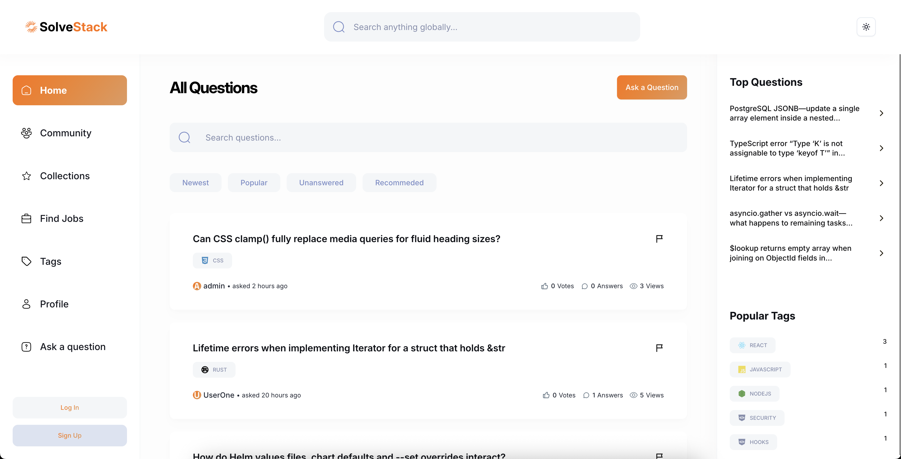
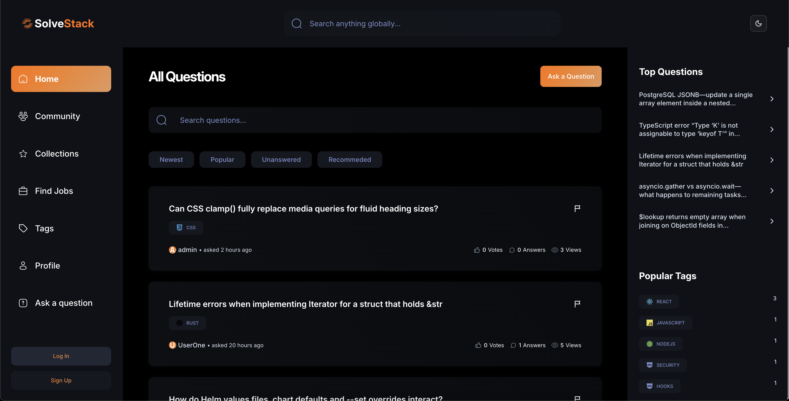

# 💻 SolveStack – MERN + Admin Dashboard


> Fork of **“The Ultimate Next.js 15 Course”** by [Adrian Hajdin – JS Mastery](https://github.com/adrianhajdin).
> **Extra features:** custom Admin Dashboard and location‑aware **Jobs** board.

A modern, full‑stack Stack Overflow clone with dark / light theme, AI‑assisted answers, and granular admin controls.

**Live demo → [https://solve-stack.vercel.app](https://solve-stack.vercel.app)**
**Admin credentials →** `admin@gmail.com` / `Admin123.` (dashboard toggle bottom‑left)





## 📦 Table of Contents

- [Description](#description)
- [Screenshots](#screenshots)
- [Installation](#installation)
- [Usage](#usage)
- [Tech Stack](#tech-stack)
- [Functions](#functions)
- [Environment Variables](#environment-variables)
- [Lecture](#lecture)
- [License](#license)

## 📝 Description

Part from course:
Project represents a newer and modern version of Stack Overflow with light & dark mode, where developers can ask questions, provide answers, and up‑/down‑vote them. Users can search for everything—other users, questions, answers and tags—using dedicated pages with filters or the global search bar. Questions can be saved for later in a personal collection. When writing an answer, users can click **Generate AI Answer** to enhance their draft using Grok AI. Each user has a profile page with reputation points, badges, and the ability to edit or delete any of their content. A profile editor lets users add a bio, portfolio link, or location. The app includes full pagination and SEO‑friendly routes.

My own additions:

- **/jobs** page that fetches and displays job listings with keyword search and country filter.
- **/dashboard** route for admins, featuring:
    - Global overview with counts of users, questions, answers, and reports
    - Monthly users & questions charts (last 12 months)
    - **Users** page – promote/demote admin, ban/unban, status labels
    - **Reports** page – review or delete reported questions
    - **Announcements** – create time‑bound messages visible on the home page

- Loading states (`loading.tsx`) for smoother UX.

## 📸 Screenshots

- Screenshots are available under /docs or click here: [See all screenshots →](https://github.com/krzysztof-pasek/solve_stack/tree/main/docs)

## 🚀 Installation

```bash
git clone https://github.com/krzysztof-pasek/solve_stack.git
cd solve_stack
npm install
cp .env.example .env
npm run dev
```

## 💻 Usage

| Script         | Purpose                                           |
| -------------- | ------------------------------------------------- |
| `npm run dev`  | Run development server at `http://localhost:3000` |
| `npm run lint` | ESLint + Prettier                                 |

### Admin workflow

1. Login with admin credentials and click **Admin Dashboard** button.
2. Review metrics on the overview page.
3. Manage users (ban, unban, promote, revoke) under **Users**.
4. Handle reports in **Reports** or post announcements in **Announcements**.

### Jobs board

- Go to `/jobs`, enter a keyword, and (optionally) select a country.
- Data is fetched server‑side.

## 🛠 Tech Stack

- **Framework & Runtime**
    - [Next.js](https://nextjs.org/) v15 (App Router)
    - [Node.js](https://nodejs.org/)

- **Frontend**
    - [React](https://react.dev/) v19 + [TypeScript 5](https://www.typescriptlang.org/)
    - [Tailwind CSS v4](https://tailwindcss.com/) + Radix UI primitives
    - [Recharts](https://recharts.org/) for charts
    - [React Hook Form](https://react-hook-form.com/), [Sonner](https://github.com/sonner-toast/sonner)

- **Backend & API**
    - Next.js API routes & Server Actions
    - [MongoDB v8](https://www.mongodb.com/) via [Mongoose v8](https://mongoosejs.com/)
    - [NextAuth.js v5](https://next-auth.js.org/) (beta) for authentication
    - [bcrypt](https://www.npmjs.com/package/bcrypt) for hashing

- **Utilities**
    - [Zod](https://github.com/colinhacks/zod) for validation
    - [Date‑fns](https://date-fns.org/) & [Day.js](https://day.js.org/) for dates
    - ESLint, Prettier, Pino logging

## 🧩 Functions

- **Core Q\&A** – CRUD questions with tags, answers; vote & bookmark.
- **Global Search** – fuzzy search across users, questions, answers, tags.
- **Reputation & Badges** – dynamic reputation system with achievements.
- **AI‑assisted Answers** – enhanced answers via Grok AI.
- **Jobs Page** – server‑side job listings, keyword + select country filters.
- **Admin Dashboard** – metrics, user management, report moderation, announcements.
- **Performance** – dynamic imports, skeleton loaders, high optimalisation.
- **Accessibility & Theme** – dark/light, keyboard‑navigable UI.

## 🔑 Environment Variables

Create a `.env.local` file and add:

```
AUTH_SECRET=<string>

AUTH_GITHUB_ID=<string - githubOauth>
AUTH_GITHUB_SECRET=<string - githubOauth>

AUTH_GOOGLE_ID=<string - googleOauth>
AUTH_GOOGLE_SECRET=<string - googleOauth>

MONGODB_URI=<db connection string>

GROQ_API_KEY=<groq api string for generating answers>

NEXTAUTH_URL=http://localhost:3000

NEXT_PUBLIC_RAPID_API_KEY=<rapid api key for fetching jobs>
```

## 🎓 Lecture

This repo began as coursework from **“The Ultimate Next.js 15 Course”**. My extensions taught me:

1. Advanced App Router patterns.
2. Designing and implementing MongoDB schemas for scalability with Mongoose.
3. Server Actions vs traditional REST endpoints.
4. Implementing global functions that are helpful during building big apps.
5. Building reusable chart components with Recharts.

## 📜 License

MIT © 2025 Krzysztof Pasek
